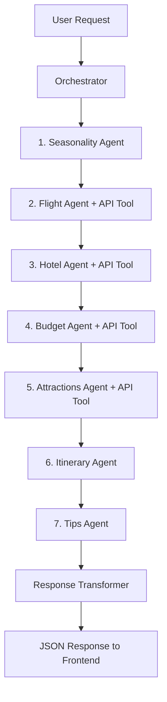

# AI Travel Planner 🌍✈️

A comprehensive full-stack travel planning system powered by AI agents, tools, and real-time data integration. Creates personalized travel itineraries with flights, hotels, budgets, attractions, and cultural tips.

## 🎥 Demo

Watch the AI Travel Planner in action:


https://github.com/user-attachments/assets/e072f646-2ee6-4dbb-920d-7a3e9e91b11b


## 🌟 Features

- **Multi-Agent AI System**: 7 specialized CrewAI agents collaborate to create comprehensive travel plans
- **Real-Time Data**: Live flight and hotel searches via Amadeus API, attractions via Google Places API
- **Intelligent Planning**: Uses GPT-4 Turbo via OpenRouter (configurable to Claude Sonnet)
- **Complete Itineraries**: Day-by-day markdown itineraries with activities, meals, and timing
- **Budget Intelligence**: Detailed cost breakdowns for tight, moderate, and flexible budgets
- **Cultural Intelligence**: Safety advice, etiquette, transportation tips, and local insights
- **Modern Stack**: FastAPI backend + Next.js 14 frontend with TypeScript
- **Tool Architecture**: External APIs wrapped as CrewAI tools for agent use

## 🏗️ Tech Stack

### Backend
- **Framework**: FastAPI (Python 3.10+)
- **AI Framework**: CrewAI for agent orchestration
- **LLM Provider**: OpenRouter (GPT-4 Turbo, Claude Sonnet 3.5)
- **API Integrations**:
  - Amadeus API (flights, hotels)
  - Google Places API (attractions, POIs)
  - Cost-of-Living data
- **Architecture**: RESTful APIs wrapped as CrewAI tools
- **Server**: Uvicorn (ASGI)

### Frontend
- **Framework**: Next.js 14 (App Router)
- **Language**: TypeScript
- **Styling**: Tailwind CSS
- **Components**: React Server Components + Client Components
- **HTTP Client**: Axios
- **Markdown**: react-markdown with remark-gfm

## 📊 System Architecture

### High-Level Overview

```
┌─────────────────────────────────────────────────────────────┐
│                  Next.js Frontend (Port 3000)               │
│  Search Form → Results Display → Itinerary Viewer           │
└───────────────────────┬─────────────────────────────────────┘
                        │ HTTP REST API
                        ▼
┌─────────────────────────────────────────────────────────────┐
│              FastAPI Backend (Port 8000)                    │
│  Routes: /plan, /health, /destinations/popular, /docs       │
└───────────────────────┬─────────────────────────────────────┘
                        │
                        ▼
┌─────────────────────────────────────────────────────────────┐
│           TravelPlanningOrchestrator                        │
│  • Coordinates 7 AI agents                                  │
│  • Manages execution flow                                   │
│  • Aggregates results                                       │
└───────────────────────┬─────────────────────────────────────┘
                        │
        ┌───────────────┴────────────────┐
        ▼                                ▼
┌──────────────────┐          ┌──────────────────┐
│  CrewAI Agents   │          │  CrewAI Tools    │
│  (7 specialized) │◄────────►│ (API wrappers)   │
└──────────────────┘          └────────┬─────────┘
                                       │
                    ┌──────────────────┼──────────────────┐
                    ▼                  ▼                  ▼
            ┌───────────────┐  ┌──────────────┐  ┌──────────────┐
            │   Amadeus     │  │    Google    │  │ Cost Data    │
            │   Flight API  │  │  Places API  │  │   Source     │
            │   Hotel API   │  │              │  │              │
            └───────────────┘  └──────────────┘  └──────────────┘
```

### Agent Workflow (Sequential Execution)



### Agent Details

| Agent | Purpose | Tools Used | Output |
|-------|---------|------------|--------|
| **Seasonality** | Analyzes best travel times, weather patterns | LLM only | Best months, weather summary, seasonal highlights |
| **Flight** | Searches and recommends flights | `FlightSearchTool` (Amadeus API) | Flight options with prices, durations |
| **Hotel** | Finds hotel accommodations | `HotelSearchTool` (Amadeus API) | Hotel options with pricing, ratings |
| **Budget** | Estimates trip costs | `BudgetLookupTool` + LLM | Budget tiers (tight/moderate/flexible) |
| **Attractions** | Discovers POIs and activities | `PlacesSearchTool` (Google API) + LLM | Categorized attractions with ratings |
| **Itinerary** | Creates day-by-day plan | LLM (synthesizes all data) | Markdown itinerary with schedule |
| **Tips** | Provides cultural/safety advice | LLM only | Etiquette, safety, transport, communication |

### Tool Architecture

All external API calls are wrapped as **CrewAI tools** for agent use:

```python
# Step 1: API integration function (regular async REST call)
async def search_flights(origin: str, destination: str, date: str) -> dict:
    """Search for flights using Amadeus API"""
    token = await get_amadeus_token()
    response = await amadeus_client.get("/v2/shopping/flight-offers", ...)
    return parse_and_format(response)

# Step 2: Wrap as CrewAI tool
class FlightSearchTool(BaseTool):
    name = "Flight Search"
    description = "Search for flights between airports"

    def _run(self, origin, destination, date):
        return asyncio.run(search_flights(origin, destination, date))

# Step 3: Agent uses the tool
agent = Agent(
    role="Flight Specialist",
    tools=[FlightSearchTool()],
    ...
)
```

This provides clean separation between AI logic (agents) and external data sources (APIs).

## 🚀 Quick Start

### Prerequisites

- **Python 3.10+** (for backend)
- **Node.js 18+** (for frontend)
- **API Keys** (required):
  - [OpenRouter](https://openrouter.ai/) - For LLM access
  - [Amadeus](https://developers.amadeus.com/) - For flight/hotel data
  - [Google Places](https://console.cloud.google.com/) - For attractions

### Installation

#### 1. Clone the Repository

```bash
git clone https://github.com/yourusername/travel_planner.git
cd travel_planner
```

#### 2. Backend Setup

```bash
cd backend

# Create virtual environment
python -m venv venv
source venv/bin/activate  # On Windows: venv\Scripts\activate

# Install dependencies
pip install -r requirements.txt

# Configure environment
cp .env.example .env
# Edit .env with your API keys (see Configuration section)
```

#### 3. Frontend Setup

```bash
cd ../frontend

# Install dependencies
npm install

# Configure environment (optional - uses localhost:8000 by default)
echo "NEXT_PUBLIC_API_URL=http://localhost:8000" > .env.local
```

### Running the Application

#### Option 1: Run Both Services (Recommended for Development)

```bash
# From project root
./start-dev.sh
```

This starts both backend (port 8000) and frontend (port 3000) with live output.

#### Option 2: Run Individually

**Backend only:**
```bash
cd backend
source venv/bin/activate
python main.py
# Available at http://localhost:8000
# API docs at http://localhost:8000/docs
```

**Frontend only:**
```bash
cd frontend
npm run dev
# Available at http://localhost:3000
```

### Verify Installation

1. **Backend**: Visit `http://localhost:8000/health`
2. **Frontend**: Visit `http://localhost:3000`
3. **API Docs**: Visit `http://localhost:8000/docs`


## 🔧 Configuration

### Backend Environment Variables

Create `backend/.env` with the following:

```bash
# ============================================
# OpenRouter (Required)
# ============================================
OPENROUTER_API_KEY=sk-or-v1-xxxxxxxxxxxxx

# ============================================
# Amadeus API (Required)
# ============================================
AMADEUS_API_KEY=your_api_key
AMADEUS_API_SECRET=your_api_secret

# Use test environment for development
# For production, change to api.amadeus.com
AMADEUS_BASE_URL=https://test.api.amadeus.com

# ============================================
# Google Places (Required)
# ============================================
GOOGLE_PLACES_API_KEY=AIzaSyXXXXXXXXXXXXXXXXXXXX

# ============================================
# Application Configuration
# ============================================
APP_NAME=Travel Planner
SITE_URL=http://localhost:8000
DEBUG=true
```

### Frontend Environment Variables

Create `frontend/.env.local` (optional):

```bash
NEXT_PUBLIC_API_URL=http://localhost:8000
```

### API Key Setup

#### OpenRouter
1. Sign up at [openrouter.ai](https://openrouter.ai/)
2. Create API key
3. Add credits to your account
4. Copy key to `OPENROUTER_API_KEY`

#### Amadeus
1. Register at [developers.amadeus.com](https://developers.amadeus.com/)
2. Create app in dashboard
3. Get API Key and API Secret from app settings
4. Copy to `.env`
5. **Note**: Test API has limited availability data

#### Google Places
1. Create project in [Google Cloud Console](https://console.cloud.google.com/)
2. Enable Places API
3. Create credentials (API Key)
4. Restrict key to Places API
5. Copy to `.env`

## 🎯 Usage

### Making a Travel Plan

1. **Access the frontend** at `http://localhost:3000`

2. **Fill the search form**:
   - **Destination**: City or country (e.g., "Tokyo", "Paris")
   - **Origin**: Your departure city/airport code (e.g., "SIN", "LAX")
   - **Departure Date**: When you want to leave (YYYY-MM-DD)
   - **Duration**: Trip length in days (default: 7)
   - **Budget Level**: tight / moderate / flexible
   - **Interests**: culture, food, nature, beach, nightlife, shopping, adventure
   - **Trip Type**: solo / couple / family / friends

3. **Submit** - Processing takes ~2-3 minutes:
   ```
   → Analyzing best travel times...
   → Searching flights...
   → Finding hotels...
   → Estimating budget...
   → Discovering attractions...
   → Creating itinerary...
   → Compiling tips...
   ```

4. **View results**:
   - **Flights**: 5+ options with prices, durations, layovers
   - **Hotels**: 5+ hotels with ratings, prices, locations
   - **Budget**: Detailed breakdown for 3 budget levels
   - **Attractions**: Categorized by type (culture, food, nature, etc.)
   - **Itinerary**: Day-by-day schedule with timing and activities
   - **Tips**: Cultural etiquette, safety, transport, communication

5. **Export**: Download plan as JSON

## 🛠️ API Reference

### `POST /plan`

Creates a comprehensive travel plan.

**Request Body:**
```json
{
  "destination": "Tokyo",
  "origin": "SIN",
  "departure_date": "2025-04-15",
  "return_date": "2025-04-22",
  "budget_level": "moderate",
  "interests": ["culture", "food", "nature"],
  "trip_type": "couple",
  "duration_days": 7
}
```

**Response:**
```json
{
  "destination": "Tokyo",
  "origin": "SIN",
  "best_dates": "March, April, May, October, November",
  "weather_summary": "Tokyo experiences four distinct seasons...",
  "flight_options": [
    {
      "price": 850.50,
      "currency": "SGD",
      "duration": "PT8H30M",
      "segments": 1,
      "one_way": false
    }
  ],
  "hotel_options": [
    {
      "name": "Shibuya Grand Hotel",
      "rating": "4",
      "price_per_night": 180.0,
      "total_price": 1260.0,
      "currency": "SGD",
      "area": "Shibuya"
    }
  ],
  "budget_estimate": {
    "tight": {
      "daily_total": 80.0,
      "meals": 30.0,
      "transport": 15.0,
      "accommodation": 35.0
    },
    "moderate": { ... },
    "flexible": { ... }
  },
  "attractions": {
    "culture": [ ... ],
    "landmarks": [ ... ],
    "food_districts": [ ... ]
  },
  "itinerary": "# 7-Day Tokyo Itinerary\n\n## Day 1...",
  "tips": {
    "culture_etiquette": { ... },
    "safety": { ... },
    "transportation": { ... }
  },
  "execution_time": 165.5
}
```

### Other Endpoints

- `GET /health` - Health check
- `GET /destinations/popular` - List of popular destinations
- `GET /docs` - Interactive Swagger documentation
- `GET /redoc` - ReDoc API documentation


### Production Considerations

1. **Amadeus Production API**:
   - Switch from `test.api.amadeus.com` to `api.amadeus.com`
   - Update `AMADEUS_BASE_URL` in `.env`
   - Production API has real availability data

2. **CORS Configuration**:
   - Update `allow_origins` in `main.py` to your frontend domain
   - Remove wildcard (`*`) for production

3. **Rate Limiting**:
   - Implement rate limiting for `/plan` endpoint
   - Add Redis caching for repeated searches

4. **Monitoring**:
   - Add logging (Sentry, LogRocket)
   - Track API usage and costs
   - Monitor LLM token consumption

5. **Security**:
   - Use secrets manager for API keys
   - Enable HTTPS
   - Implement authentication if needed

## 🧪 Testing

### Backend Tests

```bash
cd backend

# Test health endpoint
curl http://localhost:8000/health

# Test planning endpoint
curl -X POST http://localhost:8000/plan \
  -H "Content-Type: application/json" \
  -d '{
    "destination": "Paris",
    "origin": "LON",
    "budget_level": "moderate",
    "duration_days": 5
  }'

# Test hotel ID extraction
python test_hotel_extraction.py

# Test MCP tools
python -m pytest mcp_tools/tests/
```

### Frontend Tests

```bash
cd frontend

# Build test
npm run build

# Linting
npm run lint

# Type checking
npm run type-check
```


### Debug Mode

Enable debug logging:

```python
# In main.py
logging.basicConfig(level=logging.DEBUG)
```

View agent execution:
```bash
# Backend logs show agent workflow
tail -f backend.log
```

## 📝 Development Guide

### Adding a New Agent

1. Create agent file in `backend/agents/`:

```python
from crewai import Agent, Task

def create_weather_agent(llm):
    return Agent(
        role="Weather Specialist",
        goal="Analyze weather patterns",
        backstory="...",
        llm=llm,
        verbose=True
    )

def create_weather_task(agent, context):
    return Task(
        description="Analyze weather for {destination}",
        agent=agent,
        expected_output="JSON with weather analysis"
    )
```

2. Add to `orchestrator/crew.py`:

```python
from agents.weather_agent import create_weather_agent, create_weather_task

# In create_travel_planning_crew():
weather_agent = create_weather_agent(llm)
weather_task = create_weather_task(weather_agent, inputs)
```

3. Update response handling in `orchestrator_agent.py`

### Adding a New API Tool

1. Create API integration function in `backend/mcp_tools/`:

```python
async def search_restaurants(location: str, cuisine: str) -> dict:
    """Search for restaurants using Yelp API"""
    async with httpx.AsyncClient() as client:
        response = await client.get("https://api.yelp.com/v3/businesses/search", ...)
        return response.json()
```

2. Wrap as CrewAI tool and use in agents:

```python
from mcp_tools import search_restaurants

restaurant_tool = FunctionTool(
    func=search_restaurants,
    name="restaurant_search",
    description="Search for restaurants"
)

agent = Agent(
    tools=[restaurant_tool],
    ...
)
```

## 🔒 Security Notes

- Never commit `.env` files
- Rotate API keys regularly
- Use environment-specific configurations
- Implement rate limiting in production
- Validate all user inputs
- Sanitize markdown output
